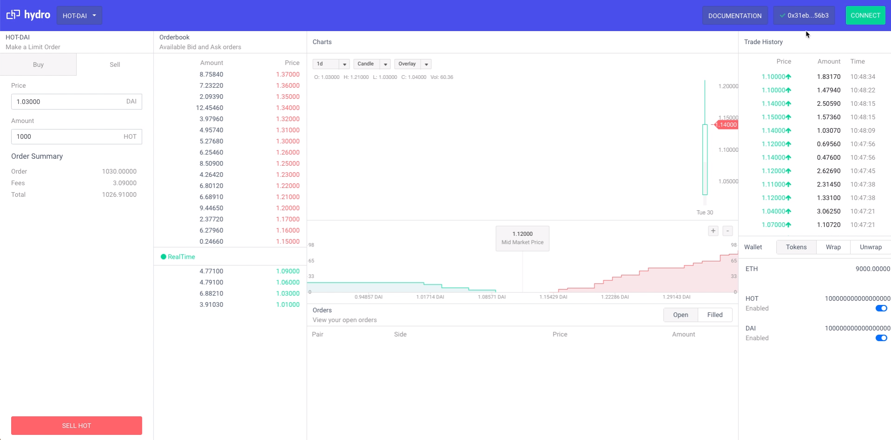

---

[Hydro Protocol](https://hydroprotocol.io) is an open source toolkit for building decentralized exchanges and DeFi applications on Ethereum. Checkout the [developer documentation](https://hydroprotocol.io/docs/overview/getting-started.html) for more details.

---

# Overview

This repository provides a basic scaffold for building a Decentralized Exchange (DEX) on the Ethereum blockchain. Follow the guides to learn how to:

- Setup an open source, fully modifyable decentralized exchange on your local server
- Send Ethereum transactions
- Make changes to the front-end UI
- Customize all parts of a DeFi application: change fees, parameters, adding markets, etc.

It should take less than 10 minutes to get your DEX running.

## Launching the Scaffold App

### Prerequisites

The easiest way to launch the scaffold dex is via `docker` and `docker-compose`.

If you don't already have them installed, you can follow [this link](https://docs.docker.com/compose/install/) to install them (free).

### Initial Setup

1.  **Clone this repo**

        git clone https://github.com/hydroprotocol/hydro-scaffold-dex.git

1.  **Change your working directory**

        cd hydro-scaffold-dex

1.  **Build and launch your hydro relayer**

        docker-compose pull && docker-compose up -d

    This step may takes a few minutes.
    When complete, it will start all necessary services.

    Note: It will use ports `3000`, `3001`, `3002`, `6379`, `8043`, and `8545` on your computer. Please make sure these ports are available.

1.  **Check out your relayer**

    Open http://localhost:3000/ on your browser to see your exchange in action!

## Testdrive Your DEX

Now that your DEX is up on your local server, let's try it out a bit.

1. **Connect a wallet**

   You can connect to a wallet by clicking the button at right-top corner. The demo is running a localhost ethereum instance, with a pre-configured wallet address:

   You can find it under the `Browser Wallet` type. The address is:

- public key: `0x31ebd457b999bf99759602f5ece5aa5033cb56b3`
- private key: `0xb7a0c9d2786fc4dd080ea5d619d36771aeb0c8c26c290afd3451b92ba2b7bc2c`

2. **Test out the trading flow**

   You might have noticed that we setup a simple market making bot on the HOT-DAI market. Try to make some trades on this active market.

## Configuring Your DEX

Our Hydro Scaffolds come with a powerful API and easy Command Line Interface (CLI) for configuring your DEX.

1.  **Login to the CLI**

        docker-compose exec admin sh

2.  **View the CLI manual to see a list of functions you can perform**

    See [admin cli manual](./manual/admin-api-and-cli.md#cli-guide-admin-cli)

3.  **Try creating a new market**

        hydro-dex-ctl market new HOT-WWW \
          --baseTokenAddress=0x4c4fa7e8ea4cfcfc93deae2c0cff142a1dd3a218 \
          --quoteTokenAddress=0xbc3524faa62d0763818636d5e400f112279d6cc0

- The base token is the first symbol (HOT above), the quote token is the second symbol (WWW above).
- You could try this with different token symbols and contract addresses.
- This creates a market with "default parameters" for fees, decimals, etc.

        hydro-dex-ctl market publish HOT-WWW

- This makes the market viewable on the frontend

4.  **Exit the CLI**

        exit

    This will exit out of the CLI and go back to the original terminal.

### Questions?

You now have a fully functioning DEX on your local system, complete with a CLI for easy customization.

1. **Support**

   Please open an Github Issue for questions, requests, or bugs.

2. **Deploying your DEX**

   Check out our [Developer Documentation](https://hydroprotocol.io/docs/overview/getting-started.html).

---

# Additional Info

## Useful Docker Commands

1.  **Display the status of all services running**

         docker-compose ps

    This command displays the status of all services running in docker. It's helpful for troubleshooting and for understanding the combination of components that goes into running your DEX.

2.  **Stopping your DEX**

         docker-compose stop

    This command will stop all of the current services running in docker.

3.  **Restarting your DEX**

         docker-compose pull && docker-compose up -d

    The same command that you ran to start it the first time can be used for subsequent restarts. Always run the pull command first, as the docker-compose up command will not run without an image.

4.  **View logs**

        # view logs of the service that defined in docker-compose.yml services
        # e.g. view watcher log
        docker-compose logs --tail=20 -f watcher
        # e.g. view api log
        docker-compose logs --tail=20 -f api

    Much like the status, viewing the logs can give you an idea of the specific details involved in each service.

5.  **Update this repo**

        git pull origin master

6.  **Completely clean the old state (data will be deleted)**

        docker-compose down -v

## What all comes in this Scaffold?

- Frontend:
  - A Basic Exchange Web UI
  - A modular Ethereum Wallet interface
- Backend:
  - API Server
  - Websocket Server to handle keepalive connections and serve realtime data
  - Matching Engine to send matching orders to the hydro smart contracts on Ethereum
  - Monitoring processes to watch for transaction changes on the blockchain
  - Examples of market making bots, including a Uniswap-like constant price AMM
- [PostgresSQL](https://www.postgresql.org) database
- [ganache-cli](https://github.com/trufflesuite/ganache-cli) to run a local ethereum node and support for ropsten and mainnet

## F&Q

- [How to run on other network and run from source?](./manual/change-network-and-run-from-source.md)
- [How to configure for external access?](./manual/config-nginx.md)

## How to setup environment for local development

See [setup dev env manual](./manual/setup-dev-env.md).

## License

This project is licensed under the Apache 2.0 License - see the [LICENSE](LICENSE) file for details
