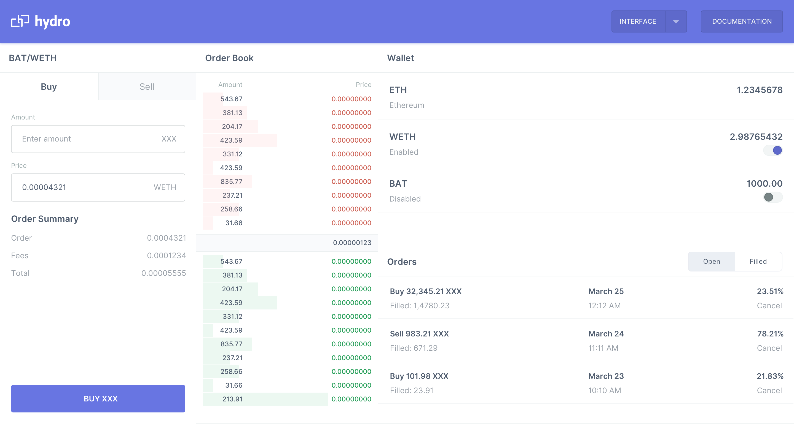

# Working in Progress

**Note**: This project is not ready yet.

# Hydro Box Dex

This repository will guide you through setting up your own Hydro Dex Relayer on the Ethereum blockchain. With a simple docker-compose command, you can have a fully functional Hydro Relayer running on your local server.

This repository describes how to use hydro-sdk to build a dex. If you want to dig into codes, Please move to the corresponding directory for more details.

## What is a Hydro Relayer?

[Hydro Protocol](https://hydroprotocol.io) is an open sourced framework for building decentralized cryptocurrency exchanges. Hydro Relayers are decentralized exchanges that utilize the Hydro system for processing trades.

## Who is this for?

This Box is for anyone interested in starting their own Hydro Relayer.

## Why use Hydro?

Hydro Protocol is an extremely powerful yet simple decentralized exchange protocol. Hydro Relayers offer the most advanced, efficient, and powerful form of decentralized trading.

This Box makes setup extremely easy for new relayers to get started. Without the need to write, audit, and refine your own smart contracts or write your own backend, you can simply style the frontend and add whatever additional feature you may like.

The native token for Hydro Protocol is completely opt-in - you are not required to hold, collect fees, or force users to use the Hydro Protocol Token to run a Hydro Relayer.

## How do I start a local relayer?

0.  As a prerequisite, you must have `docker` and `docker-compose` installed.

    If not, you can follow [this link](https://docs.docker.com/compose/install/) to install them.
    If you are new to docker and git, make sure you setup your git access key and ssh key.

1.  Clone this repo

        git clone https://github.com/hydroprotocol/hydro-box-dex.git

1.  Change working dir

        cd hydro-box-dex

1.  Start

        docker-compose pull && docker-compose up -d

    This step may takes a few minutes to prepare all envs.
    When complete, this will start all necessary services in docker.

    It will use ports `3000`, `3001`, `3002`, `6379`, `8545` on your computer. Please make sure theses ports are available.

1.  View Relayer

    Open `http://localhost:3000/` on your browser. Proceed to the next step to use your Relayer.

1.  Setup wallet and address

    1.  Install metamask wallet

        Currently, we only support metamask as your wallet. If you have metamask installed, please move to the next section.

        - For Chrome [Download](https://chrome.google.com/webstore/detail/metamask/nkbihfbeogaeaoehlefnkodbefgpgknn).
        - For Firefox [Download](https://addons.mozilla.org/en-US/firefox/addon/ether-metamask/)
        - For Brave, metamask is built-in. <a href="about:preferences#extensions" targert="_blank">Enable</a>

    1.  Setup network

        The default network of metamask is mainnet. We will use **localhost** to test for now.

        Open the metamask extension and switch the network to `localhost:8545`

    1.  Import an account

        We have already prepare an address for you. The private key is `0xb7a0c9d2786fc4dd080ea5d619d36771aeb0c8c26c290afd3451b92ba2b7bc2c`, address is `0x31ebd457b999bf99759602f5ece5aa5033cb56b3`.

        Import the private key into your metamask then switch to this account.

    1.  All set

        Now you are free to play around with this box on `http://localhost:3000/`.

1.  Launch a simple maker

    Run the follow command in another terminal. It will start a simple maker to fill the orderbook of `HOT-DAI` market. You will see a live exchange in your browser now.

        docker run --rm --net host hydroprotocolio/hydro-box-dex-backend:latest maker

1.  Get status

        docker-compose ps

    This will show each service running status.

1.  View logs

        # view logs of the service that defined in docker-compose.yml services
        # e.g. view watcher log
        docker-compose logs --tail=20 -f watcher
        # e.g. view api log
        docker-compose logs --tail=20 -f api

    This will show logs of the service which you point.

1.  Stop

        docker-compose stop

    This will stop all services.

## How do I update to the latest?

0.  Update This repo

        git pull origin master

1.  Clean old state (data wil be deleted)

        docker-compose down -v

1.  Run

        docker-compose pull && docker-compose up -d

    Always pull latest images before docker-compose up (If image doesn't have new version, will not pull).

## What comes with this box?

- Frontend:
  - A Basic Exchange Web UI
- Backend:
  - Http Server to serve API data
  - Websocket Server to handle keepalive connections and serve realtime data
  - Matching Engine to send matching orders to the hydro smart contract
  - Blockchain Monitor to watch for transaction changes on the blockchain
- [Sqlite3](https://www.sqlite.org/index.html) as database
- [ganache-cli](https://github.com/trufflesuite/ganache-cli) to run a local ethereum node

## License

This project is licensed under the Apache 2.0 License - see the [LICENSE](LICENSE) file for details
